# Keybinding Map & ErgoDox EZ Tuning

## Keybinding Graph

> Edges = keys pressed. Empty circle nodes = waiting for another key. Rectangle nodes = command executed.

```mermaid
graph LR
  %% ================================================================
  %% SYSTEM — Hyprland  (modifier = Super)
  %% ================================================================
  subgraph SYS["System · Hyprland  (Super)"]
    direction LR
    SUP(("Super"))
    SUPSH(("Super\n+Shift"))
    PRNT(("Print"))
    SHPRNT(("Shift\n+Print"))
    XF86(("XF86\nmedia"))

    SUP -->|Q| s_term["ghostty"]
    SUP -->|C| s_kill["Kill window"]
    SUP -->|M| s_exit["Exit Hyprland"]
    SUP -->|E| s_fm["nautilus"]
    SUP -->|V| s_float["Toggle floating"]
    SUP -->|Space| s_menu["wofi launcher"]
    SUP -->|P| s_pseudo["Pseudo tile"]
    SUP -->|J| s_tsplit["Toggle dwindle split"]
    SUP -->|H| s_fl["Focus left"]
    SUP -->|K| s_fu["Focus up"]
    SUP -->|L| s_fr["Focus right"]
    SUP -->|"1–0"| s_ws["Workspace N"]
    SUP -->|S| s_scratch["Scratchpad toggle"]
    SUP -->|"scroll-dn"| s_wsn["Workspace e+1"]
    SUP -->|"scroll-up"| s_wsp["Workspace e-1"]
    SUP -->|"LMB drag"| s_mwin["Move window"]
    SUP -->|"RMB drag"| s_rwin["Resize window"]

    SUPSH -->|"1–0"| s_mws["Move window to workspace N"]
    SUPSH -->|S| s_mscratch["Move to scratchpad"]
    SUPSH -->|L| s_lock["hyprlock"]

    PRNT -->|" "| s_shot["Screenshot: window"]
    SHPRNT -->|" "| s_region["Screenshot: region"]

    XF86 -->|"Vol+/−"| s_vol["Volume ±5%"]
    XF86 -->|"Mute"| s_mute["Mute toggle"]
    XF86 -->|"MicMute"| s_mic["Mic mute toggle"]
    XF86 -->|"Bright+/−"| s_brt["Brightness ±5%"]
    XF86 -->|"Play/Pause"| s_play["Play / Pause"]
    XF86 -->|"Next"| s_next["Next track"]
    XF86 -->|"Prev"| s_prev["Prev track"]
  end

  %% ================================================================
  %% ZELLIJ  (modal terminal multiplexer — default = normal mode)
  %% ================================================================
  subgraph ZEL["Terminal Multiplexer · Zellij  (Alt / Ctrl+Alt)"]
    direction LR

    ZALT(("Alt"))
    ZALTSH(("Alt\n+Shift"))
    ZCTRL(("Ctrl\n+Alt"))

    %% ── Always on (shared_except locked) ──
    ZALT -->|"h/j/k/l"| za_foc["MoveFocusOrTab"]
    ZALT -->|"[ / ]"| za_tabnav["Prev / Next tab"]
    ZALT -->|"1–9"| za_goto["Go to tab N"]
    ZALT -->|t| za_newtab["New tab"]
    ZALT -->|d| za_pnd["New pane down"]
    ZALT -->|r| za_pnr["New pane right"]
    ZALT -->|f| za_float["Toggle floating panes"]
    ZALT -->|n| za_newp["New pane (generic)"]
    ZALT -->|i| za_tabl["Move tab left"]
    ZALT -->|o| za_tabr["Move tab right"]
    ZALT -->|p| za_grp["Toggle pane in group"]
    ZALT -->|x| za_cls["Close focus (any mode)"]
    ZALT -->|w| za_ses["Session manager"]
    ZALTSH -->|"[ / ]"| za_lay["Prev / Next layout"]
    ZALTSH -->|p| za_grpm["Toggle group marking"]

    ZCTRL -->|g| z_locked["locked mode"]
    ZCTRL -->|q| z_quit["Quit"]

    %% ── Mode-switch keys (Ctrl+Alt to avoid nvim conflicts) ──
    ZCTRL -->|p| ZPANE(("pane\nmode"))
    ZCTRL -->|t| ZTAB(("tab\nmode"))
    ZCTRL -->|n| ZRSZ(("resize\nmode"))
    ZCTRL -->|h| ZMOV(("move\nmode"))
    ZCTRL -->|s| ZSCR(("scroll\nmode"))
    ZCTRL -->|o| ZSES(("session\nmode"))
    ZCTRL -->|b| ZTMX(("tmux\nmode"))

    %% ── pane mode ──
    ZPANE -->|"h/j/k/l"| zp_foc["Move focus"]
    ZPANE -->|c| zp_ren["Rename pane"]
    ZPANE -->|d| zp_dn["New pane down"]
    ZPANE -->|r| zp_rt["New pane right"]
    ZPANE -->|s| zp_stk["New pane (stacked)"]
    ZPANE -->|n| zp_new["New pane"]
    ZPANE -->|f| zp_fs["Toggle fullscreen"]
    ZPANE -->|e| zp_emb["Embed / Float toggle"]
    ZPANE -->|i| zp_pin["Toggle pinned"]
    ZPANE -->|w| zp_fa["Toggle all floating"]
    ZPANE -->|z| zp_frm["Toggle frames"]
    ZPANE -->|x| zp_cls["Close pane"]
    ZPANE -->|p| zp_sw["Switch focus"]

    %% ── tab mode ──
    ZTAB -->|"h/k/left/up"| zt_prev["Previous tab"]
    ZTAB -->|"j/l/right/dn"| zt_next["Next tab"]
    ZTAB -->|"1–9"| zt_goto["Go to tab N"]
    ZTAB -->|n| zt_new["New tab"]
    ZTAB -->|r| zt_ren["Rename tab"]
    ZTAB -->|x| zt_cls["Close tab"]
    ZTAB -->|s| zt_sync["Sync tabs"]
    ZTAB -->|b| zt_brk["Break pane"]
    ZTAB -->|"[ / ]"| zt_brkd["Break pane L / R"]

    %% ── resize mode ──
    ZRSZ -->|"h/j/k/l"| zr_inc["Resize + in dir"]
    ZRSZ -->|"H/J/K/L"| zr_dec["Resize − in dir"]
    ZRSZ -->|"+/="| zr_up["Resize +"]
    ZRSZ -->|"−"| zr_dn["Resize −"]

    %% ── move mode ──
    ZMOV -->|"h/j/k/l"| zm_mv["Move pane in dir"]
    ZMOV -->|n| zm_cy["Move pane (cycle)"]
    ZMOV -->|p| zm_bk["Move pane backwards"]

    %% ── scroll mode ──
    ZSCR -->|"h/left"| zs_pgu["Page up"]
    ZSCR -->|"l/right"| zs_pgd["Page down"]
    ZSCR -->|"j/dn"| zs_dn["Scroll line down"]
    ZSCR -->|"k/up"| zs_up["Scroll line up"]
    ZSCR -->|d| zs_hd["Half page down"]
    ZSCR -->|u| zs_hu["Half page up"]
    ZSCR -->|e| zs_ed["Edit scrollback"]
    ZSCR -->|s| ZSRCH(("search\nmode"))
    ZSRCH -->|n| zsr_nx["Search down"]
    ZSRCH -->|p| zsr_pv["Search up"]
    ZSRCH -->|c| zsr_cs["Toggle case sensitivity"]
    ZSRCH -->|o| zsr_ww["Toggle whole word"]
    ZSRCH -->|w| zsr_wr["Toggle wrap"]

    %% ── session mode ──
    ZSES -->|a| zss_ab["About Zellij"]
    ZSES -->|c| zss_cf["Configuration"]
    ZSES -->|l| zss_lay["Layout manager"]
    ZSES -->|p| zss_pl["Plugin manager"]
    ZSES -->|s| zss_sh["Share session"]
    ZSES -->|w| zss_mg["Session manager"]
    ZSES -->|d| zss_dt["Detach"]

    %% ── tmux-compat mode ──
    ZTMX -->|"h/j/k/l"| ztm_fc["Move focus"]
    ZTMX -->|c| ztm_nt["New tab"]
    ZTMX -->|n| ztm_nx["Next tab"]
    ZTMX -->|p| ztm_pv["Previous tab"]
    ZTMX -->|z| ztm_fs["Toggle fullscreen"]
    ZTMX -->|x| ztm_cl["Close pane"]
    ZTMX -->|d| ztm_dt["Detach"]
    ZTMX -->|o| ztm_np["Focus next pane"]
    ZTMX -->|Space| ztm_ly["Next swap layout"]
    ZTMX -->|"["| ztm_sc["scroll mode"]
    ZTMX -->|","| ztm_rn["Rename tab"]
    ZTMX -->|"%"| ztm_rt["New pane right"]
    ZTMX -->|dquote| ztm_dn_p["New pane down"]
  end

  %% ================================================================
  %% NVIM  (leader = Space)
  %% ================================================================
  subgraph NV["Neovim  (leader = Space)"]
    direction LR
    NLD(("Space\n(leader)"))
    NNRM(("Normal"))
    NINS(("Insert"))
    NVIS(("Visual"))
    NTEL(("Telescope\nInsert"))
    NCTRL(("Ctrl"))

    %% ── leader: single-key leaves ──
    NLD -->|n| nv_tree["Neotree sidebar"]
    NLD -->|q| nv_locl["Diagnostics to loclist"]
    NLD -->|f| nv_fmt["Format buffer (LSP)"]
    NLD -->|v| nv_vspl["Split vertical"]
    NLD -->|h| nv_hspl["Split horizontal"]
    NLD -->|"="| nv_eqsp["Equalize splits"]
    NLD -->|D| nv_tdef["Type definition"]
    NLD -->|e| nv_diagf["Diagnostic float"]

    %% r — LSP rename
    NLD -->|r| NVr((" "))
    NVr -->|n| nv_ren["LSP rename"]

    %% b — buffer / tab management
    NLD -->|b| NVb((" "))
    NVb -->|n| nv_tabnew["New tab"]
    NVb -->|x| nv_tabcls["Close buffer"]

    %% w — workspace folders (no longer also close-buffer)
    NLD -->|w| NVw((" "))
    NVw -->|w| nv_cbuf["Close window"]
    NVw -->|a| nv_wadd["Add workspace folder"]
    NVw -->|r| nv_wrem["Remove workspace folder"]
    NVw -->|l| nv_wlst["List workspace folders"]

    %% c — code actions
    NLD -->|c| NVc((" "))
    NVc -->|a| nv_ca["Code actions"]

    %% p — pickers
    NLD -->|p| NVp((" "))
    NVp -->|f| nv_ff["Find files (ripgrep)"]
    NVp -->|s| nv_lgr["Live grep"]
    NVp -->|c| nv_gsc["Grep string (cursor)"]
    NVp -->|b| nv_buf["Buffers"]
    NVp -->|h| nv_hlp["Help tags"]

    %% g — git
    NLD -->|g| NVg((" "))
    NVg -->|c| nv_gc["Git commits"]
    NVg -->|b| nv_gb["Git branches"]
    NVg -->|s| nv_gst["Git status"]
    NVg -->|f| NVgf((" "))
    NVgf -->|c| nv_gbc["Git buffer commits"]

    %% d — debug
    NLD -->|d| NVd((" "))
    NVd -->|t| nv_dbp["Toggle breakpoint"]
    NVd -->|c| nv_dco["Continue debug"]

    %% a — AI (CodeCompanion)
    NLD -->|a| NVa((" "))
    NVa -->|p| nv_aip["AI: action palette"]
    NVa -->|t| nv_ait["AI: toggle chat"]
    NVa -->|a| nv_aia["AI: add selection"]
    NVa -->|i| nv_aii["AI: inline"]
    NVa -->|c| nv_aic["AI: new chat"]

    %% t — TODOs
    NLD -->|t| NVt((" "))
    NVt -->|t| nv_tod["Find TODOs"]
    NVt -->|n| nv_ton["Next TODO"]
    NVt -->|p| nv_top["Prev TODO"]

    %% ── normal mode (no leader) ──
    NNRM -->|K| nv_hov["LSP hover doc"]
    NNRM -->|gD| nv_decl["Go to declaration"]
    NNRM -->|gd| nv_def["Go to definition"]
    NNRM -->|gi| nv_impl["Go to implementation"]
    NNRM -->|gr| nv_ref["Show references"]
    NNRM -->|"[d"| nv_dpv["Prev diagnostic"]
    NNRM -->|"]d"| nv_dnx["Next diagnostic"]
    NNRM -->|J| nv_jn["Join line (cursor fixed)"]
    NNRM -->|n| nv_sn["Search next (centered)"]
    NNRM -->|N| nv_sp["Search prev (centered)"]
    NNRM -->|Tab| nv_tn["Next buffer"]
    NNRM -->|S-Tab| nv_tp["Prev buffer"]
    NNRM -->|gcc| nv_cmt["Toggle line comment"]
    NNRM -->|gbc| nv_cmtb["Toggle block comment"]

    %% ── Ctrl (normal mode) ──
    NCTRL -->|d| nv_scrd["Scroll down (centered)"]
    NCTRL -->|u| nv_scru["Scroll up (centered)"]
    NCTRL -->|a| nv_sela["Select all"]
    NCTRL -->|h| nv_wl["Window left"]
    NCTRL -->|j| nv_wd["Window down"]
    NCTRL -->|k| nv_wu["Window up"]
    NCTRL -->|l| nv_wr["Window right"]

    %% ── insert mode ──
    NINS -->|jk| nv_esc["Escape"]
    NINS -->|C-k| nv_sig["LSP signature help"]
    NINS -->|C-Space| nv_cmp["Trigger completion"]
    NINS -->|C-e| nv_cab["Abort completion"]
    NINS -->|Enter| nv_ccf["Confirm completion"]
    NINS -->|C-b| nv_cdu["Scroll docs up"]
    NINS -->|C-f| nv_cdd["Scroll docs down"]

    %% ── visual mode ──
    NVIS -->|J| nv_vdn["Move selection down"]
    NVIS -->|K| nv_vup["Move selection up"]

    %% ── Telescope insert mode ──
    NTEL -->|C-k| nv_tpv["Previous result"]
    NTEL -->|C-j| nv_tnx["Next result"]
    NTEL -->|C-q| nv_tqf["Send to quickfix"]
  end
```



---

## Conflicts Fixed

| # | Was | Fix applied |
|---|-----|-------------|
| 1 | `<leader>ee` equalize splits (races with `<leader>e` diagnostic) | → `<leader>=` |
| 2 | `<leader>r` SonicPi run + `<leader>s` SonicPi stop (macOS-only, conflicts with LSP rename) | Removed sonicpi.lua |
| 3 | `Ctrl-s` = tmux prefix conflicts with Zellij scroll mode | Removed tmux dotfile; Zellij only |
| 4 | `Ctrl-Alt-h/j/k/l` window nav (3-modifier combo) | Removed; use native `<C-w>h/j/k/l` |
| 5 | `<C-A-t>` / `<C-A-w>` for new/close tab (3-modifier combos) | → `<leader>bn` / `<leader>bx` |
| 6 | Zellij `Alt+[/]` was Prev/Next swap layout (obscure) | → Prev/Next tab; layout moved to `Alt+Shift+[/]` |
| 7 | Zellij tab/pane/session ops required Ctrl+t/p/o mode entry | → Direct `Alt` bindings: `Alt+t/d/r/w`, `Alt+1–9`, `Alt+x` global |
| 8 | Zellij `Ctrl+h/p/t/n/s/o/b/g/q` intercepted keys (conflicted with nvim) | → All mode-switches moved to `Ctrl+Alt+X` |
| 9 | nvim `<C-k>` signature help in normal mode (blocked window-up nav) | → Moved to insert mode; `<C-h/j/k/l>` now direct window navigation |

---

## ErgoDox EZ Remaining Recommendations (firmware-level, not in dotfiles)

### 1. Thumb cluster layout

| Thumb key | Suggestion | Why |
|-----------|-----------|-----|
| Left inner | `Super` (tap) | Hyprland prefix on the strongest finger; `Super+hjkl` becomes left-thumb + right-hand arc |
| Left outer | `Space` (tap) / `Alt` (hold) | nvim leader + Zellij `Alt-*` bindings on one key |
| Right inner | `Enter` (tap) / `Ctrl` (hold) | Confirmation + mode switches |
| Right outer | `Backspace` (tap) / `Shift` (hold) | |

### 2. Home row mods (QMK / Oryx)

Hold-tap on the home row makes every multi-modifier binding single-handed:

```
A → A (tap) / Ctrl (hold)
S → S (tap) / Alt  (hold)
F → F (tap) / Super (hold)
```

With this: `Super+H/J/K/L` (Hyprland focus) = `F`-hold + hjkl. `Alt+H/J/K/L` (Zellij move) = `S`-hold + hjkl.

### 3. Physical Escape / raise timeoutlen

`jk` adds a 300 ms delay before every Escape. With ErgoDox, put `Escape` on a thumb tap and raise `timeoutlen` in nvim:

```lua
-- set.lua
vim.o.timeoutlen = 500  -- more breathing room for which-key
```

### 4. nvim window navigation via QMK layer

Since `<C-w>h/j/k/l` is now the window-nav binding, you can optionally make a QMK layer key that holds `Ctrl+w` so that tapping hjkl moves between splits with one thumb + home row.

### 5. `hjkl` direction model across all layers (already consistent)

| Layer | `h/j/k/l` meaning |
|-------|--------------------|
| Hyprland | Focus ← ↓ ↑ → |
| Zellij normal | MoveFocusOrTab |
| Zellij pane mode | Move focus |
| Zellij resize | Increase size in dir (Shift = decrease) |
| Zellij scroll | Page/scroll |
| nvim | Standard motion |

All consistent — no changes needed.
